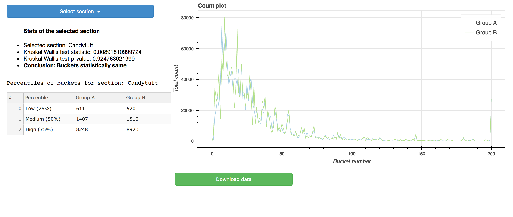

The bucket_comparator app creates an interactive visualization for a set of section data. 
It does statistical tests, decides whether two samples are from the same distribution and shows percentile breakdown.

Running
=======

Bokeh Server
------------

To view the app from a bokeh server, you need to run a bokeh server and point it at the bucket_comparator example directory. 
For example, from this directory, you can run:

    bokeh serve .

Or from one directory level up, you can run:

    bokeh serve bucket_comparator

Now navigate to the following URL in a browser:

    http://localhost:5006/bucket_comparator

Data and Functionality
======================

The data (bucket_comparator/data/data.csv) has the following colums:
section, bucket, group_A, group_B.

There are 10 sections containing 201 buckets. Each bucket has count under two groups (group_A, group_B).
When you run the app all sections will be available in a dropdown. You can browse the sections. For a selected section
the app will do the following

* Show a count plot for all the buckets in two groups
* Do Kruskal–Wallis non-parametric test (https://en.wikipedia.org/wiki/Kruskal%E2%80%93Wallis_one-way_analysis_of_variance) and
  show whether group_A, group_B count values of the buckets are from the same distributon or not.
* Show test statistic and p-value of the Kruskal–Wallis non-parametric test
* Show percentiles (25, 50 and 75) of group_A, group_B counts for the buckets in a Table

You can also download the data of the selected section using "Download data" button.

Cheers!

